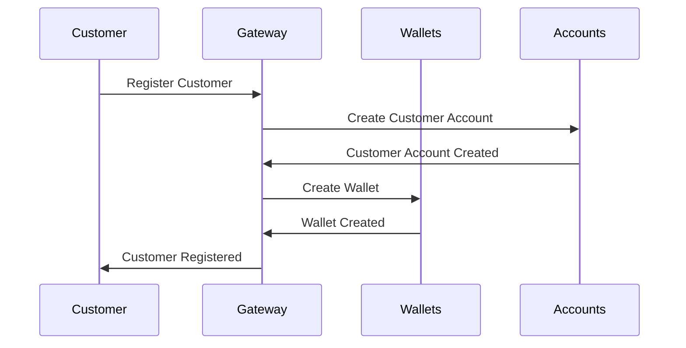
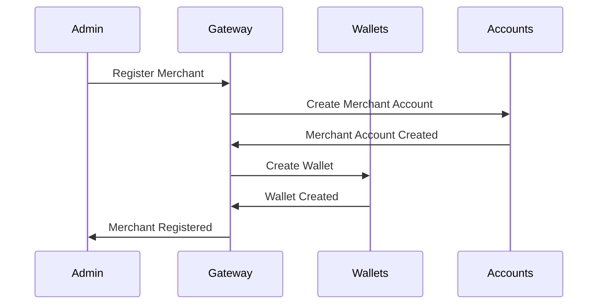
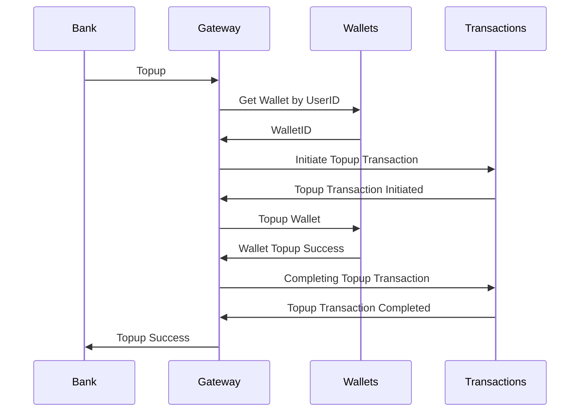
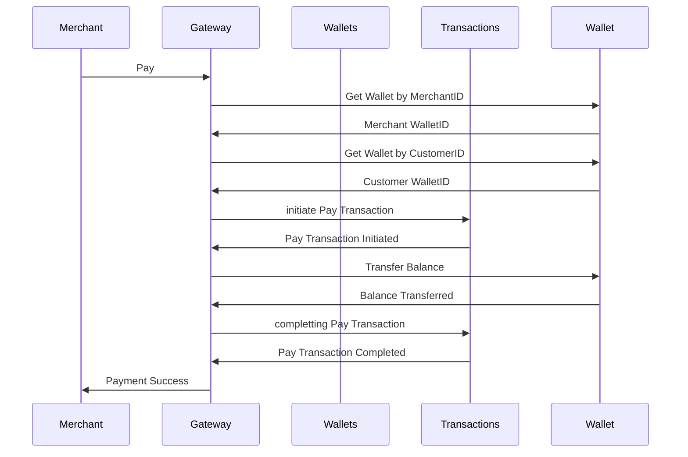
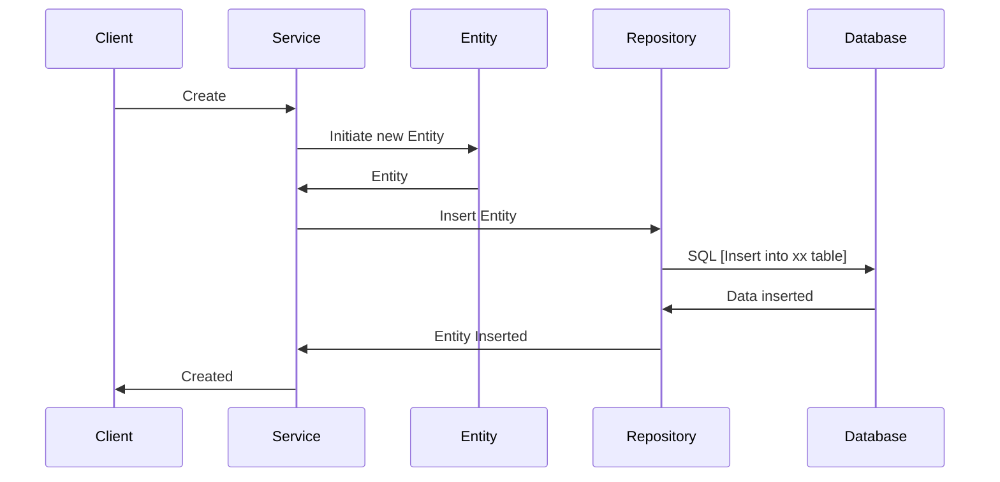
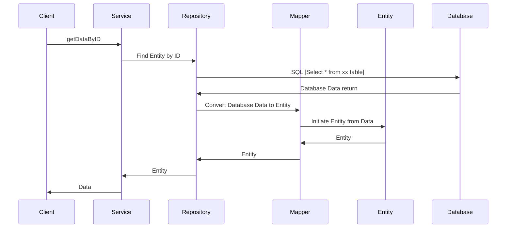

# Logic Sequence Diagram
 This script can be shown as Sequence Diagram on `https://mermaidjs.github.io/mermaid-live-editor`

 ### Register Customer

### Register Merchant

### Topup

### Pay

 # Common Sequence Diagram

 ### Create Entity Flow

  ### Find Entity Flow
